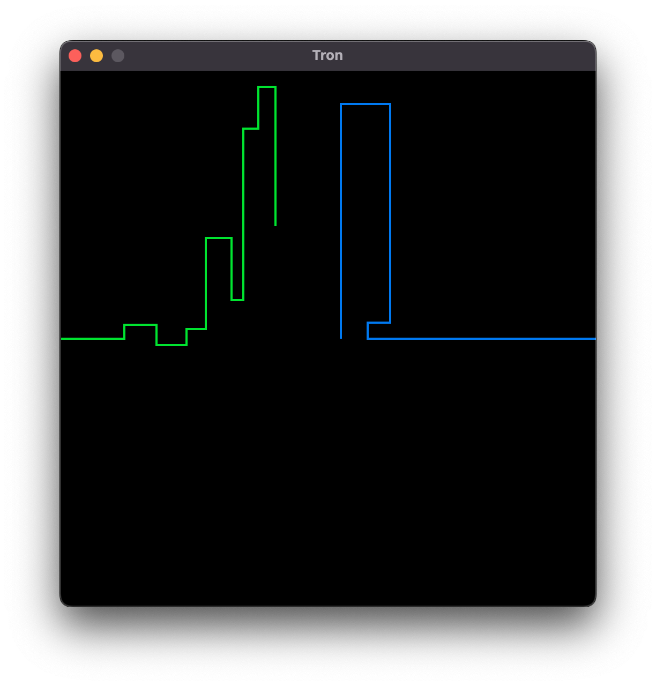

# 2-Player Tron Lightcycle

A super duper simple 2-player Tron Lightcycle game. Used as an excuse to write something in [Odin](https://odin-lang.org).

## Controls

Restart the game by pressing `SPACE`

### Player 1

Uses VIM keybindings:
* Left: H
* Right: L
* Up: K
* Down: J

### Player 2

* Left: A
* Right: D
* Up: W
* Down: S
